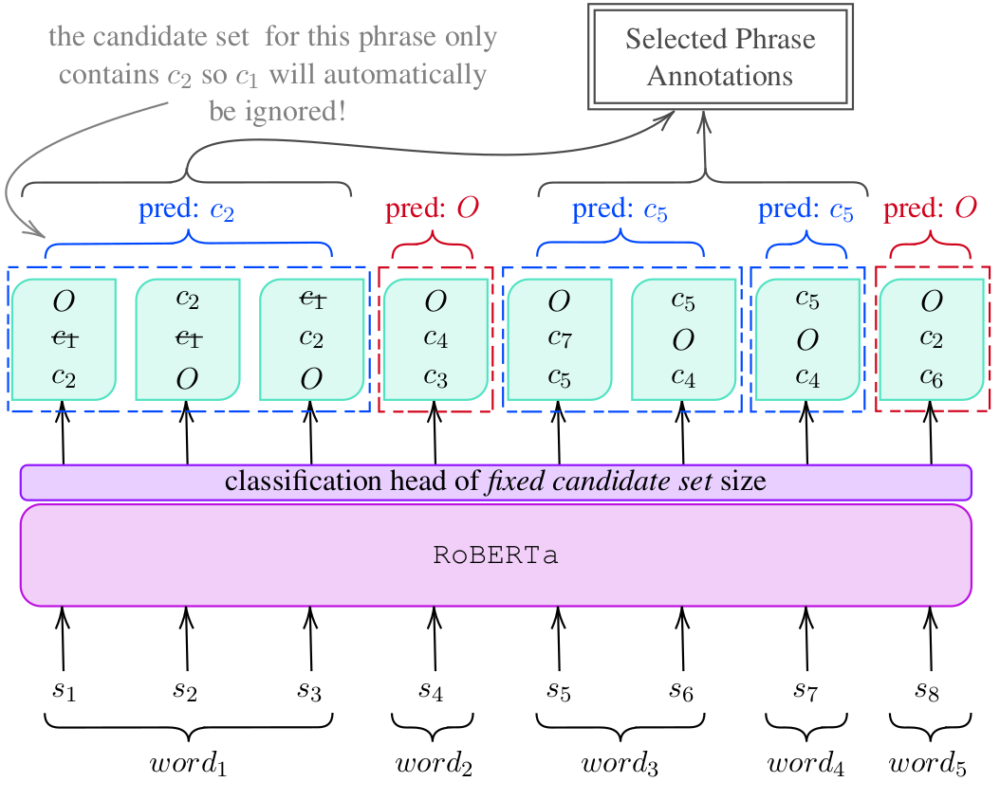

<p align="center" width="100%"></p>

---
[](https://paperswithcode.com/sota/entity-linking-on-aida-conll?p=spel-structured-prediction-for-entity-linking)
[](https://paperswithcode.com/sota/entity-linking-on-aida-testc?p=spel-structured-prediction-for-entity-linking)

**SpEL** (**S**tructured **p**rediction for **E**ntity **L**inking)  is a structured prediction entity linking approach 
that uses new training and inference ideas obtaining a new state of the art on Wikipedia entity linking, with better 
compute efficiency and faster inference than previous methods. 
It was proposed in our EMNLP 2023 paper [SpEL: Structured Prediction for Entity Linking](https://arxiv.org/abs/2310.14684).
It outperforms the state of the art on the commonly used 
[AIDA benchmark](https://www.mpi-inf.mpg.de/departments/databases-and-information-systems/research/ambiverse-nlu/aida/downloads) 
dataset for entity linking to Wikipedia. Apart from being more accurate, it also is the most compute efficient in terms 
of number of parameters and speed of inference.

The following figure schematically explains the SpEL framework using an example:

<p align="center" width="100%"></p>

This repository contains the source code to finetune RoBERTa models and evaluate them using [GERBIL](https://github.com/dice-group/gerbil).

For a live demo checkout [here](https://huggingface.co/spaces/sshavara/SpEL) on huggingface spaces.

---

Entity Linking evaluation results of *SpEL* compared to that of the literature over AIDA test sets:

| Approach                                                        | EL Micro-F1<br/>test-a | EL Micro-F1<br/>test-b |            #params<br/>on GPU            | speed<br/>sec/doc |
|-----------------------------------------------------------------|:----------------------:|:----------------------:|:----------------------------------------:|:-----------------:|
| Hoffart et al. (2011)                                           |          72.4          |          72.8          |                    -                     |         -         |
| Kolitsas et al. (2018)                                          |          89.4          |          82.4          |                  330.7M                  |       0.097       |
| Broscheit (2019)                                                |          86.0          |          79.3          |                  495.1M                  |       0.613       |
| Peters et al. (2019)                                            |          82.1          |          73.1          |                    -                     |         -         |
| Martins et al. (2019)                                           |          85.2          |          81.9          |                    -                     |         -         |
| van Hulst et al. (2020)                                         |          83.3          |          82.4          |                  19.0M                   |       0.337       |
| Févry et al. (2020)                                             |          79.7          |          76.7          |                    -                     |         -         |
| Poerner et al. (2020)                                           |          90.8          |          85.0          |                  131.1M                  |         -         |
| Kannan Ravi et al. (2021)                                       |           -            |          83.1          |                    -                     |         -         |
| De Cao et al. (2021b)                                           |           -            |          83.7          |                  406.3M                  |      40.969       |
| De Cao et al. (2021a)<br/>(no mention-specific candidate set)   |          61.9          |          49.4          |                  124.8M                  |       0.268       |
| De Cao et al. (2021a)<br/>(using PPRforNED candidate set)       |          90.1          |          85.5          |                  124.8M                  |       0.194       |
| Mrini et al. (2022)                                             |           -            |          85.7          |  (train) 811.5M<br/>(test) 406.2M        |         -         |
| Zhang et al. (2022)                                             |           -            |          85.8          |                 1004.3M                  |         -         |
| Feng et al. (2022)                                              |           -            |          86.3          |                  157.3M                  |         -         |
| <hr/>                                                           |         <hr/>          |         <hr/>          |                  <hr/>                   |       <hr/>       |
| **SpEL-base** (no mention-specific candidate set)               |          91.3          |          85.5          |                  128.9M                  |       0.084       |
| **SpEL-base** (KB+Yago candidate set)                           |          90.6          |          85.7          |                  128.9M                  |       0.158       |
| **SpEL-base** (PPRforNED candidate set)<br/>(context-agnostic)  |          91.7          |          86.8          |                  128.9M                  |       0.153       |
| **SpEL-base** (PPRforNED candidate set)<br/>(context-aware)     |          92.7          |          88.1          |                  128.9M                  |       0.156       |
| **SpEL-large** (no mention-specific candidate set)              |          91.6          |          85.8          |                  361.1M                  |       0.273       |
| **SpEL-large** (KB+Yago candidate set)                          |          90.8          |          85.7          |                  361.1M                  |       0.267       |
| **SpEL-large** (PPRforNED candidate set)<br/>(context-agnostic) |          92.0          |          87.3          |                  361.1M                  |       0.268       |
| **SpEL-large** (PPRforNED candidate set)<br/>(context-aware)    |          92.9          |          88.6          |                  361.1M                  |       0.267       |

----

Downloads and Preparations:
===========================

AIDA dataset:
-------------
Initially you need to prepare the AIDA dataset. For this:

1. Download and extract [aida-yago2-dataset.zip](http://resources.mpi-inf.mpg.de/yago-naga/aida/download/aida-yago2-dataset.zip).
2. Download the CoNLL-2003 data files from [conll2003/ner](https://www.cnts.ua.ac.be/conll2003/ner/) and copy/paste the generated `eng.testa`, `eng.testb`, `eng.train` files into the extracted `aida-yago2-dataset` directory, and run `java -jar aida-yago2-dataset.jar`; this will create a file named `AIDA-YAGO2-dataset.tsv`.
4. Place `AIDA-YAGO2-dataset.tsv` under `resources/data/` directory (you can find `resources` directory besides `src` directory in the main project folder).
5. A preprocessed version of this dataset will be automatically downloaded for finetuning step 3.

Note: As the `README.txt` file inside `aida-yago2-dataset` states:
```
The original CoNLL 2003 data is split into 3 parts: TRAIN, TESTA, TESTB.
We keep the ordering among the documents as in the original CoNLL data,
where the parts contain the following docids:

TRAIN: '1 EU' to '946 SOCCER'
TESTA: '947testa CRICKET' to '1162testa Dhaka'
TESTB: '1163testb SOCCER' to '1393testb SOCCER'
```

How to use SpEL
---------------
All the required datasets for all three finetuning steps of SpEL as well as the finetuned models for evaluation will be 
automatically downloaded when you start the process (finetune or evaluation), and you **do not need to** download 
anything to initiate the finetuning/evaluation.

Here is how you can run each of the possible tasks in SpEL:

### Global knowledge finetuning step 1: 

```shell
export PYTHONPATH=/path/to/SpEL/src
cd /path/to/SpEL/src/spel
python finetune_step_1.py
```
The `finetune_step_1.py` script will automatically expand the process across as many GPUs as you have and will perform 
finetuning using all of those. The provided default settings are suitable for Titan RTX 2080 GPUs with 24GB GPUs.

### Global knowledge finetuning step 2:


```shell
export PYTHONPATH=/path/to/SpEL/src
cd /path/to/SpEL/src/spel
python finetune_step_2.py
```

You may also tweak the default parameters of `finetune_step_2.py` script to adapt the script to your available hardware.

### Domain specific fine-tuning (step 3):


```shell
export PYTHONPATH=/path/to/SpEL/src
cd /path/to/SpEL/src/spel
python finetune_step_3.py
```

The `finetune_step_3.py` script will be able to run on an Nvidia 1060 GPU with 6GBs of GPU and will finish within one hour.

### Changing SpEL Default Size:

You can find the configuration file that hints SpEL which model size to consider in `src/spel/base_model.cfg`.
Currently, it is set to `roberta-base`, using which you will be able to replicate the `base` configuration experiments.
You may change its content to `roberta-large` to be able to replicate the experiments with the `large` models.

### Local evaluation:

```shell
export PYTHONPATH=/path/to/SpEL/src
cd /path/to/SpEL/src/spel
python evaluate_local.py
```

The `evaluate_local.py` script will download the evaluation data and test both the Global knowledge finetuned model 
(by default finetuned after step 2) and the domain specific finetuned model. 
Please note that the numbers this script returns are subword-level F-scores and are not comparable to the GERBIL numbers.
This script is solely intended for internal evaluation and sanity testing the finetuned models, and not for entity 
linking performance evaluation.

### Annotation Visualization:

```shell
# pip install streamlit
export PYTHONPATH=/path/to/SpEL/src
cd /path/to/SpEL/src/spel
python -m streamlit run visualize.py
```

The `visualize.py` script provides a visualization tool using `streamlit` library. The tool will show a textbox and 
loads up the SpEL finetuned model. When the `Annotate` button is pressed it passes the text from the textbox to SpEL and
visualizes the annotated text below the textbox. The script by default will load up the step-3 finetuned model and does 
not consider any candidate sets. The fixed candidate set on this dataset is limited to the 5600 wikipedia ids from the
original AIDA dataset.

### SpEL Finetuned Models and Data:
As formerly stated, you **do not need to** download anything to initiate the finetuning/evaluation; however, if you 
would prefer to download the models and use them outside the SpEL framework, you may download the models through the 
following links:
   
   - [SpEL-base-step-1.pt](https://vault.sfu.ca/index.php/s/9OAoAG5eYeREE9V/download)
   - [SpEL-base-step-2.pt](https://vault.sfu.ca/index.php/s/Hf37vc1foluHPBh/download)
   - [SpEL-base-step-3.pt](https://vault.sfu.ca/index.php/s/HpQ3PMm6A3y1NBl/download)
   - [SpEL-large-step-1.pt](https://vault.sfu.ca/index.php/s/bTp6UN2xL7Yh52w/download)
   - [SpEL-large-step-2.pt](https://vault.sfu.ca/index.php/s/rnDiuKns7gzADyb/download)
   - [SpEL-large-step-3.pt](https://vault.sfu.ca/index.php/s/kBBlYVM4Tr59P0q/download)

As well, you may access the created finetuning data through the following:
   
   - [FT-Step1-Data (20230827)](https://1sfu-my.sharepoint.com/:u:/g/personal/sshavara_sfu_ca/Ea3IVbOpkTJKpASNyL9aFGMBQpH0ABU2hQa-wYyakkZ9TQ?e=DJFF3v)
   - [FT-Step2-Data (20230827)](https://1sfu-my.sharepoint.com/:u:/g/personal/sshavara_sfu_ca/EeS_Tgl_CFJNiTh6YH5IDrsBocEZUsZV3lxPB6pleTxyxw?e=caH1cf)
   - [FT-Step3-Data (AIDA)](https://1sfu-my.sharepoint.com/:u:/g/personal/sshavara_sfu_ca/EajEGYyf8LBOoxqDaiPBvbgBwFuEC08nssvZwGJWsG_HXg?e=wAwV6H)

### Usage:

The following snippet demonstrates a quick way that SpEL can be used to generate subword-level, word-level, and phrase-level annotations for a sentence.

```python
from transformers import AutoTokenizer
from spel.model import SpELAnnotator
from spel.configuration import device
from spel.utils import get_subword_to_word_mapping
from spel.span_annotation import WordAnnotation, PhraseAnnotation
finetuned_after_step = 4
sentence = "Grace Kelly by Mika reached the top of the UK Singles Chart in 2007."
tokenizer = AutoTokenizer.from_pretrained("roberta-base")
# ############################################# LOAD SpEL #############################################################
spel = SpELAnnotator()
spel.init_model_from_scratch(device=device)
if finetuned_after_step == 3:
    spel.shrink_classification_head_to_aida(device)
spel.load_checkpoint(None, device=device, load_from_torch_hub=True, finetuned_after_step=finetuned_after_step)
# ############################################# RUN SpEL ##############################################################
inputs = tokenizer(sentence, return_tensors="pt")
token_offsets = list(zip(inputs.encodings[0].tokens,inputs.encodings[0].offsets))
subword_annotations = spel.annotate_subword_ids(inputs.input_ids, k_for_top_k_to_keep=10, token_offsets=token_offsets)
# #################################### CREATE WORD-LEVEL ANNOTATIONS ##################################################
tokens_offsets = token_offsets[1:-1]
subword_annotations = subword_annotations[1:]
word_annotations = [WordAnnotation(subword_annotations[m[0]:m[1]], tokens_offsets[m[0]:m[1]])
                    for m in get_subword_to_word_mapping(inputs.tokens(), sentence)]
# ################################## CREATE PHRASE-LEVEL ANNOTATIONS ##################################################
phrase_annotations = []
for w in word_annotations:
    if not w.annotations:
        continue
    if phrase_annotations and phrase_annotations[-1].resolved_annotation == w.resolved_annotation:
        phrase_annotations[-1].add(w)
    else:
        phrase_annotations.append(PhraseAnnotation(w))
```

### Entity linking evaluation using GERBIL:
```shell
export PYTHONPATH=/path/to/SpEL/src
cd /path/to/SpEL/src/spel
python server.py [spel,openai] [n, k, pg, pw]
```

You can use `server.py` to serve SpEL to GERBIL for evaluation. For the first argument you can choose to either serve
`spel` or to redirect the GERBIL queries to chatgpt interface using `openai` argument. Please note that for the `openai`
setting you need to have set your `OPENAI_API_KEY` as another environment variable.

For the `spel` setting, you can choose either of the four candidate set selection settings.
`n` will mean no candidate set will be used in evaluation, `k` signals using KB+Yago candidate sets, `pg` will point the
model to use the context agnostic version of PPRforNED candidate set and `pw` will point the model to use the context 
aware version of PPRforNED candidate set.

The provided `server.py` is an example implementation of `gerbil_connect` interface which is explained in more detail in
its [README](src/gerbil_connect/README.md) file.

####  Which API should I use to replicate the experiments?

`server.py` implements several APIs which you can use to replicate our results.

* To replicate the results from Table 1 over the original AIDA test sets (`testa` and `testb`) and SpEL results of Table 
  3, you can connect GERBIL to `http://localhost:3002/annotate_aida`.
* To replicate the results of Table 4, as well as any experiment on `MSNBC` and our `AIDA/testc` experiments, 
  you can connect GERBIL to `http://localhost:3002/annotate_wiki`.
* To replicate the results of Table 5 (out-of-domain) over `Derczynski`, `KORE`, and `OKE` experiments, you can connect 
  GERBIL to `http://localhost:3002/annotate_dbpedia`.
* To replicate the results of Table 5 (out-of-domain) over `N3 Reuters` and `N3 RSS` experiments, you can connect
  GERBIL to `http://localhost:3002/annotate_n3`.
   

#### how can I use GERBIL for evaluation?

1. Checkout [GERBIL repository](https://github.com/dice-group/gerbil) and run `cd gerbil/ && ./start.sh`
    - It will require Java 8 to run.
2. Once gerbil is running, run `python server.py` with your desired configuration parameters. It will start listening on `http://localhost:3002/`.
3. Open a browser and type in `http://localhost:1234/gerbil/config`, this will open up the visual experiment configuration page of GERBIL.
4. Leave `Experiment Type` as `A2KB`, for `Matching` choose `Ma - strong annotation match`, and for `Annotator` set a preferred name (e.g. `Experiment 1`) and in `URI` set `http://localhost:3002/annotate_aida`.
5. Choose your evaluation `Dataset`s, for example choose `AIDA/CoNLL-Test A` and `AIDA/CoNLL-Test B` for evaluation on AIDA-CoNLL.
6. Check the disclaimer checkbox and hit `Run Experiment`.
7. Let GERBIL send in the evaluation documents (from the datasets you selected) one by one to the running server. Once it is done you can click on the URL printed at the bottom of the page (normally of the format `http://localhost:1234/gerbil/experiment?id=YYYYMMDDHHMM`) to see your evaluation results.

AIDA/testc dataset:
-------------------
We have annotated a new dataset comprising 131 Reuters news articles basing on the NER dataset of (Liu and Ritter 2023;
https://aclanthology.org/2023.acl-long.459). This dataset contains 1,145 unique new entity identifiers and spans over 
4,028 mentions, encompassing a total of 46,456 words. You can find this dataset under [`resources/data/aida_testc.ttl`](resources/data/aida_testc.ttl).
This dataset is in NIF format and can be easily integrated into GERBIL.

### How can I integrate AIDA/testc into GERBIL?
Here is the simple modifications you need to do:

1. If you are running GERBIL, stop the process.
2. Put [`resources/data/aida_testc.ttl`](resources/data/aida_testc.ttl) in `gerbil/gerbil_data/datasets/aida`
3. Open `gerbil/src/main/properties/datasets.properties` (this properties file contains the dataset configurations for GERBIL).
4. Copy the following lines underneath the last line defining AIDA/CoNLL-Test B:
   ```
   org.aksw.gerbil.datasets.AIDATestC.file=${org.aksw.gerbil.DataPath}/datasets/aida/aida_testc.ttl
   org.aksw.gerbil.datasets.definition.AIDATestC.name=AIDA/CoNLL-Test C
   org.aksw.gerbil.datasets.definition.AIDATestC.class=org.aksw.gerbil.dataset.impl.nif.FileBasedNIFDataset
   org.aksw.gerbil.datasets.definition.AIDATestC.cacheable=true
   org.aksw.gerbil.datasets.definition.AIDATestC.experimentType=A2KB
   org.aksw.gerbil.datasets.definition.AIDATestC.constructorArgs=${org.aksw.gerbil.datasets.AIDATestC.file},${org.aksw.gerbil.datasets.definition.AIDATestC.name}
   ```
5. Run GERBIL, the new dataset should show up.

"Practicality of the Fixed Candidate Sets" Experimental  Results:
-----------------------------------------------------------------
In this part, we remove the constraint over the model entity vocabulary to the fixed candidate set of the in-domain data 
entity vocabulary. We assume the entirety of the 500K most frequent Wikipedia identifiers as well as the in-domain and 
out-of-domain data entity vocabularies to form the model output vocabulary. The following are the checkpoints used in 
the experiments resulting in the following results.

* [SpEL-base-step3-500K.pt](https://vault.sfu.ca/index.php/s/8nw5fFXdz2yBP5z/download)
* [SpEL-large-step3-500K.pt](https://vault.sfu.ca/index.php/s/BCvputD1ByAvILC/download)

| Approach                                                              | EL Micro-F1<br/>test-a | EL Micro-F1<br/>test-b | EL Micro-F1<br/>test-c |
|-----------------------------------------------------------------------|:----------------------:|:----------------------:|:----------------------:|
| **SpEL-base-500K** (no mention-specific candidate set)                |          89.6          |          82.3          |          73.7          |
| **SpEL-base-500K** (KB+Yago candidate set)                            |          89.5          |          83.2          |          57.2          |
| **SpEL-base-500K** (PPRforNED candidate set)<br/>(context-agnostic)   |          90.8          |          84.7          |          45.9          |
| **SpEL-base-500K** (PPRforNED candidate set)<br/>(context-aware)      |          91.8          |          86.1          |           -            |
| **SpEL-large-500K** (no mention-specific candidate set)               |          89.7          |          82.2          |          77.5          |
| **SpEL-large-500K** (KB+Yago candidate set)                           |          89.8          |          82.8          |          59.4          |
| **SpEL-large-500K** (PPRforNED candidate set)<br/>(context-agnostic)  |          91.5          |          85.2          |          46.9          |
| **SpEL-large-500K** (PPRforNED candidate set)<br/>(context-aware)     |          92.0          |          86.3          |           -            |
----

## Citation
If you use SpEL finetuned models or data, gerbil_connect, or AIDA/testc dataset, please cite our paper:

```
@inproceedings{shavarani2023spel,
  title={Sp{EL}: Structured Prediction for Entity Linking},
  author={Shavarani, Hassan S.  and  Sarkar, Anoop},
  booktitle={The 2023 Conference on Empirical Methods in Natural Language Processing},
  year={2023},
  url={https://openreview.net/forum?id=Jo9P7hrDdy}
}
```
